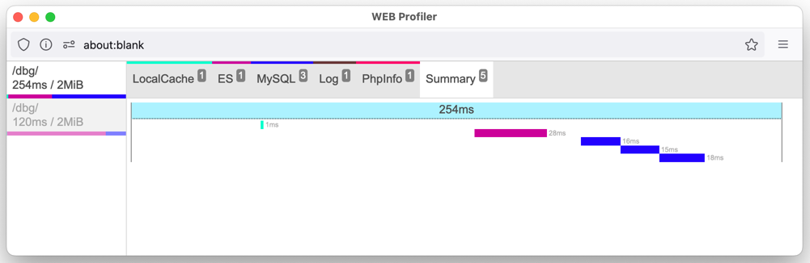
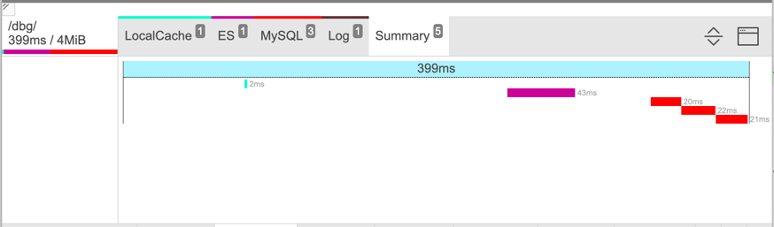

# WEB Profiler UI

Created to simplify process of bottlenecks searching in a web
projects. [Click here](http://kirik.github.io/web-profiler-ui/) to see it in action.

## Features

- backend independent design: can be used with any backend (php, golang, node.js, java, ...)
    - php `supported` (please refer to the [library](https://github.com/kirik/web-profiler-php))
    - golang `in development`
  - for other please don't hesitate to PR adapter for your programming language
- [docked mode](#docked-mode)
- [floating window mode](#floating-window-mode)
- waterfall span view
- AJAX requests support
- small footprint
- no dependencies: written with vanilla JS, CSS and HTML
- stateful with localStorage (remembers docing/floating mode, folding and size)
- go to row from Summary view (just click on span)

### Floating window mode



### Docked mode



## Build&Run

You don't need to run anything just to play with profiler. Please
see [playground](http://kirik.github.io/web-profiler-ui/).

If you'd like to run project locally:

1. clone this project

```shell
git clone git@github.com:kirik/web-profiler-ui.git && cd web-profiler-ui
```

2. run any HTTP server to open `index.html`:

**Python**

```shell
python3 -m http.server
```

**PHP**

```shell
php -S localhost:8000
```

**IntelliJ IDEs**

you can run project with you IntelliJ IDE using embedded webserver. Just open `index.html` and click on favorite
browser icon in browser toolbar:


## Internals

Profiler is embedding using iframe just to avoid CSS collisions with the parent page.

- [script.js](view%2Fscript.js) contains all JS used to render profiling data
- [style.css](view%2Fstyle.css) contans main CSS for profiler
- [template.html](view%2Ftemplate.html) is the main template file

Backends should send appropriate response to be parsed by profiler and draw spans:

```json
{
  // (string) URI
  "request_uri": "/uri/requested/",
  // (int) overall memory used by request in bytes
  "peak_memory": 0,
  // (array) collectors objects, see `Collector object`
  "collectors_data": [],
  // (float) unix timestamp with microseconds
  "start_time": 1708231434.391469,
  // (float) overall time used to respond in seconds (with microseconds)
  "duration": 0.39930295944213867,
  // Not Implemented Yet
  "request_headers": [],
  // Not Implemented Yet
  "response_headers": []
}
```

**Collector object**

```json
{
  "props": {
    // (string, required) title to show in profiler's tab
    "title": "Log",
    // (string, required) template for collector's data to display; available tamplates:
    //    - `table`: data will be displayed as table
    //    - `html`: data will be shown as html
    "template": "table",
    // (string, optional) color associated with this collector
    //    - can be either hex `#af0000`, `rgb(255,0,0)` or color name `gold`
    //    - if no color specified, predefined color will be associated (by crc32 from `title` and 216-color palette)
    "cssColor": "#663333",
    // (float, required) summary time for this collector 
    "duration": 0,
    // (object, required) list of metrics, which this collector is collecting
    "metrics": {
      // (string, required) metric key (unique in metrics context)
      "key": {
        // (string, required) metric title, which will be displayed
        "title": "Title",
        // (string, required) metric data type - different types, has it's own format logic:
        //    - `seconds` - will be formatted as Xs/Xms/Xμs
        //    - `bytes` - will be formatted as XB/XKiB/XMiB/...
        //    - `unixtime` - will be formatted as time (for example: 23:43:54) 
        //    - `integer` - will be formatted as number
        //    - `json` - 
        //    - `text` - long texts (such as SQL queries)
        //        For `table` template next features are available:
        //          text will be truncated with ellipsises (using CSS);
        //          duplicated values will be highlighted;
        //          copy full content on double click;
        //    - `string` (default) - just a string value, will not be truncated as oppose to `text` type
        "type": "type"
      },
      // `__start_time` and `__duration` are standard metrics which will be used to generate Summary tab
      // with spans waterfall. You can skip this metrics to not display collector in Summary tab
      "__start_time": {
        "title": "Start time",
        "type": "seconds"
      },
      "__duration": {
        "title": "Duration",
        "type": "seconds"
      }
    }
  },
  "data": [
    {
      "message": "\"test\"",
      "file_line": "\/var\/www\/html\/App\/Dbg\/Controller\/Index.php:362",
      "time": 1708231434
    }
  ]
}
```

To render AJAX responses they should provide full response with `__profiler` property along with buisness data:

```json
{
  ...,
  "__profiler": {
    /*full profiler response*/
  }
}
```

I'm avoiding to use http-headers to send profiler data with ajax as it requires special settings fot http-servers.
I also don't like to save responses to files to use them later, as it requires writable filesystem and other file
related logic (be KISS).

### Adapters

Adapter is a small piece of language related code (aka interface), to connect UI to web project.
Supported adapters:

- PHP ([library](https://github.com/kirik/web-profiler-php))
- Golang (WIP)

## Developing

[Makefile](Makefile) is used just to minify CSS and JS after editing.

### [PHP adapter](adapters/Renderer.php)

Please init composer with command

```shell
composer dumpautoload
```

and then open [index.php](index.php).

## Roadmap

1. [x] create playground
2. [ ] add php library
3. [ ] add golang adapter and library
4. [ ] add dark mode
